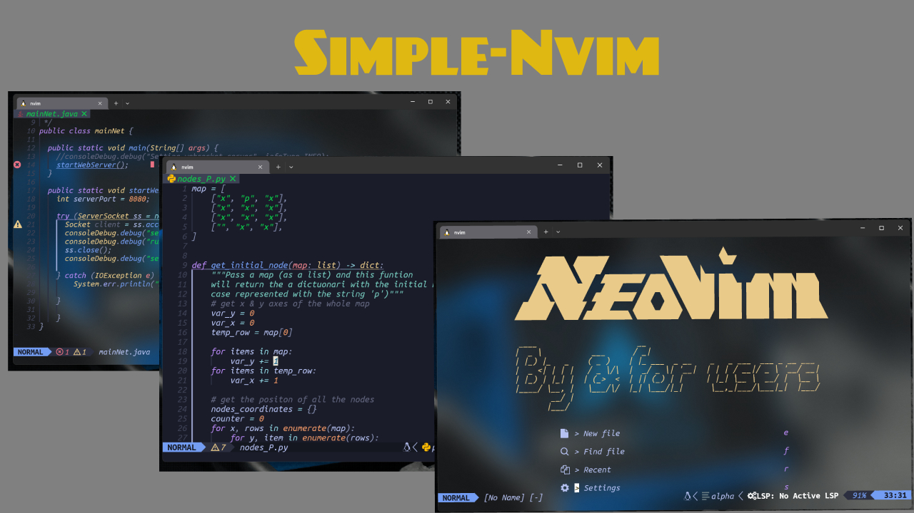

Dutch?
<PLACEHOLDER FOR GERMAN DOCUMENTATION>

Español?
<PLACEHOLDER FOR SPANISH DOCUMENTATION>


<h1>What is this project?</h1>




**This is simple but features rich configuration of neovim written in lua this configuration uses lazy nvim to managed the following plugins**

- Telescope: for file navigation (more info at [Telescope](https://github.com/nvim-telescope/telescope.nvim))

- Alpha-nvim: for the configuration of the banner (more info at [Alpha-nvim](https://github.com/goolord/alpha-nvim))

- Lua-line: to personalize the information line (more info at [Lua-line](https://github.com/nvim-lualine/lualine.nvim))

- Catppuccino: theme for the configuration (more info at [Catppuccino](https://github.com/catppuccino/nvim))

- Treesitter: for better syntax highlighting (more info at [Treesitter](https://github.com/nvim-treesitter/nvim-treesitter))

- LSP servers with Mason (more info at [Mason](https://github.com/williamboman/mason.nvim))

- Telescope: another file navigator (more info at [Telescope](https://github.com/nvim-telescope/telescope.nvim))

- Toggleterminal: for better terminal integration (more info at [Toggleterm](https://github.com/akinsho/toggleterm.nvim))
  
- Git integration: such as show changes in current file (more info at [Git Plugin](https://github.com/lewis6991/gitsigns.nvim))

- Indentation-Lines: to show indentation lines (more info at [Indent](https://github.com/lukas-reineke/indent-blankline.nvim))

- Auto-pairs: to auto complete characters such as '(' '{' (more info at [Auto-pairs](https://github.com/windwp/nvim-autopairs))


https://github.com/klkgang/simple-Nvim/assets/139710771/3b3b6c13-a98c-4709-bf41-3045e683ca13


**ALL PLUGINS AND THEIR CONFIGURETIONS ARE IN** 
```bash
~/.config/nvim/lua/plugins
```
<h1>HOW TO INSTALL?</h1>


### Step One
First, ensure that Neovim is installed on your system, and you have a .config directory for the configuration. If you don't see the .config directory in your home directory, create it by running:

```bash
mkdir -p ~/.config/nvim
```

### Step two 

Set everything up with this command
```bash
cd ~/.config/nvim/ && git clone https://github.com/klkgang/simple-Nvim/ && cd simple-Nvim && mv * .. && cd .. && rm -rf simple-Nvim
```

That's it! Now simply run nvim and start exploring the configuration.
